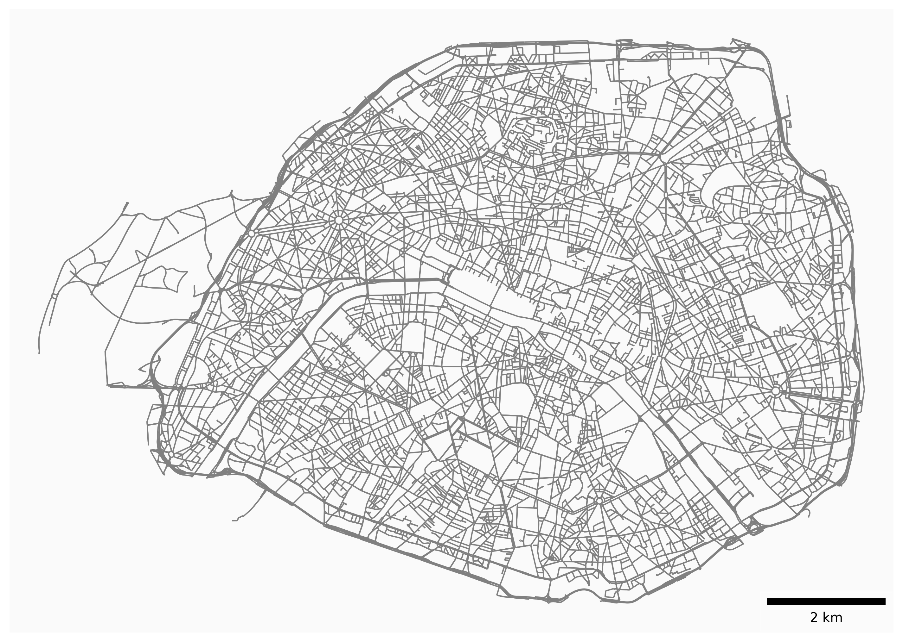

# OSMnx Plots Batch Script

This is a little fun repo inspired, and using tools from OSMnx

https://github.com/gboeing/osmnx-examples

This script automates the generation and saving of OSMnx transport network plots for a list of places. You can use predefined templates (e.g., `germany_100`, `brandenburg_10`) or provide your own list of places via the command line. Optionally, filenames can be anonymized and a mapping table can be exported.

## Features
- plot road network of the place of you choice
- Parallel processing of multiple locations for fast results
- Add custom places via command line arguments
- Selection from predefined place templates (`germany_100`, `brandenburg_10`)
- Optional anonymized filenames (random IDs)
  - Export of the mapping table as a TAB separated file (human and machine readable)

## Requirements

- Python 3.11 or newer
- All dependencies installed (see `pyproject.toml` or install via `pip install -r requirements.txt`)

## Usage

### Basic usage

```
uv run run_osmnx.py --output_dir ./output_directory
```

### Provide your own list of places

#### Using the city names in the file name
```
uv run run_osmnx.py --output_dir ./examples/paris_berlin/clear_names --place_names "Paris, France" "Berlin, Germany"
```





#### Using anonymized file names (for some quiz fun)
```
uv run run_osmnx.py --output_dir ./examples/paris_berlin/encoded --place_names "Paris, France" "Berlin, Germany" --encoded
```

### Use a place template

This will plot the 10 largest cities/towns of the German state of Brandenburg (the region I am living)

```
uv run run_osmnx.py --output_dir ./examples/brandenburg/clear_names --template brandenburg_10
```

## Arguments

| Argument         | Type     | Description                                                                                          |
|------------------|----------|------------------------------------------------------------------------------------------------------|
| `--output_dir`   | Path     | **Required.** Directory where plots and the mapping table will be saved.                             |
| `--template`     | String   | Place template to use, e.g., `germany_100` or `brandenburg_10`. If not set, must use `--place_names`.|
| `--place_names`  | Strings  | Custom place names (each in double quotes if containing spaces). Overrides the template if provided.  |
| `--encoded`      | Flag     | If set, filenames will be anonymized and a mapping table will be saved.                              |
| `--n_jobs`       | Integer  | Number of parallel jobs to use (default: 1).                                                         |

## Example Output

- Transport network plots in the specified output directory
- If `--encoded` is set: a `location_ids.tab` file mapping random IDs to place names

## Notes

- If `--place_names` is provided, only those places will be used (the template is ignored).
- Parallel processing uses 1 job(s) by default (adjustable in the script).
- Each place name with spaces must be wrapped in double quotes.

---

**Happy plotting!** 🚀
